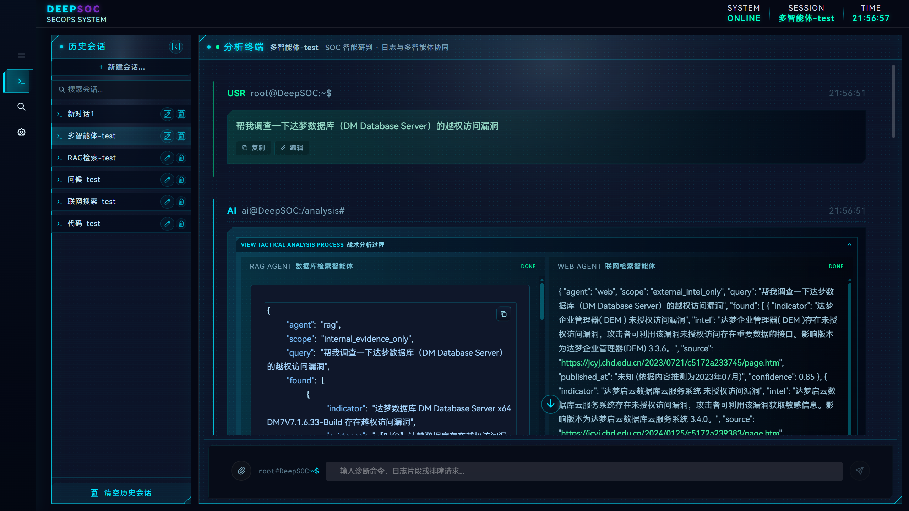
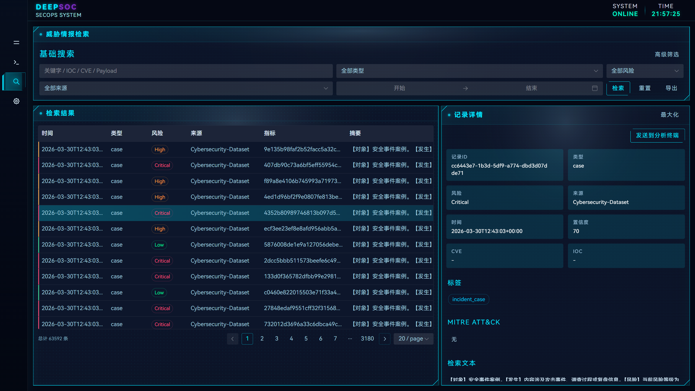
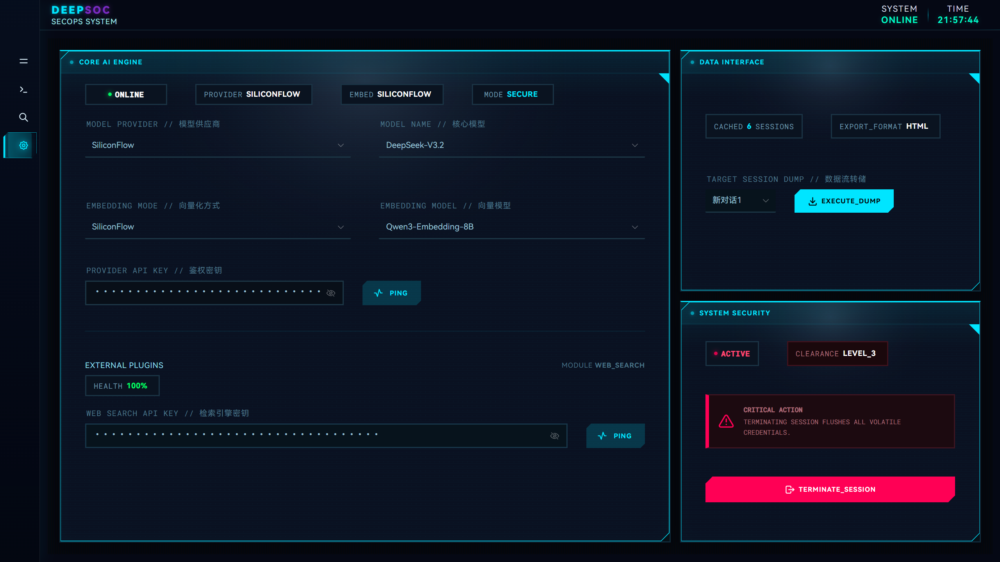

<div align="center">

# 🛡️ DeepSOC
### 基于多智能体协同与 RAG 架构的智能安全运营系统
**Next-Generation Intelligent Security Operations Center Powered by Multi-Agent Orchestration & Hybrid RAG**

<p align="center">
  
  
  
  
  
  
  
</p>

<p align="center">
  <a href="#-核心特性与系统展示">🌟 核心特性</a> •
  <a href="#️-系统架构">🏗️ 系统架构</a> •
  <a href="#-快速开始">🚀 快速开始</a> •
  <a href="#️-高级配置与工程细节">📚 接口与协议</a> •
  <a href="#️-高级配置与工程细节">📁 目录结构</a>
</p>

<br/>


</div>

---

## 📖 项目简介

**DeepSOC** 是一个面向现代化网络安全日志分析与威胁研判场景的智能 SOC（Security Operations Center）运营系统。系统采用前后端分离架构，深度融合**多智能体协同调度（Multi-Agent Orchestration）**、**混合检索增强生成（Hybrid RAG）**与**交互式 3D 资产威胁拓扑**，实现从威胁检测、日志检索、多模情报关联到自动化研判处置的完整软件工程闭环。

- **多智能体协同研判**：调度内部 RAG 检索与外部 Web 检索智能体并发执行，综合研判并实时流式推送可视化证据链与推理过程。
- **混合驱动与精准溯源**：意图信号提取（CVE / IP / MITRE / 哈希）+ 向量召回 + 关键词重排，提供 Group 级结构化可溯源证据。
- **开箱即用与灵活路由**：支持 SiliconFlow、DeepSeek、OpenAI 及本地 Ollama 等多种模型 Provider，内置连通性诊断与智能降级机制。

---

## ✨ 核心特性与系统展示

### 1. 🤖 多智能体协同分析（Multi-Agent Collaboration）
- **并发意图研判**：支持 `VectorAgent`（内部日志与威胁情报检索）与 `SearchAgent`（外部联网威胁情报收集）双路并行调度，最终由 `SynthesisAgent` 综合研判并输出结构化处置报告。
- **全链路可视化状态流**：通过 Server-Sent Events (SSE) 实时呈现 Agent 执行生命周期（`agent_status` / `agent_chunk`），支持深度思考链（Deep Thinking）与可解释性溯源。
- **动态模型配置**：支持对各智能体分别指定模型与参数，支持“编辑最近一条用户消息后重问”与“重新生成”状态回退。

<div align="center">
  
</div>

<br/>

### 2. 🌐 全景 3D 资产拓扑与态势感知（3D Threat Topology & Dashboard）
- **Three.js 交互式 3D 拓扑**：动态渲染资产节点与威胁链路，支持按 CVE/IP 搜索、高危/中危风险分级过滤、自动旋转、节点锁定与高亮聚焦。
- **全屏沉浸与智能降级**：支持标准 Fullscreen API 全屏沉浸模式与 Modal 弹窗全屏双通道自动回退机制。
- **态势联动与一键研判**：态势雷达、日志流入波形与分类分布图表全链路打通，支持点击节点一键流转下钻至分析终端预填模板。

<div align="center">
  
</div>

<br/>

### 3. 🔍 结构化威胁情报检索（Structured Intel Query & Hybrid RAG）
- **意图驱动精确+语义召回**：自动提取 CVE、IP、MITRE ATT&CK 战术 ID、哈希等意图信号，结合 ChromaDB 向量语义检索与关键词融合重排，支持主路径与松弛召回。
- **Group 级可追溯证据链**：输出结构化聚合证据（`group_key`、`entity_summary`、`evidence_chain`），精准追溯 `record_file` 与 `record_line`。
- **Master-Detail 主从分析视图**：支持多维筛选过滤、实时详情预览、字段高亮复制与 CSV/JSON 多格式按需导出。

<div align="center">
  
</div>

<br/>

### 4. ⚙️ 灵活模型路由与连通性诊断（Model Routing & Enterprise Governance）
- **多 Provider 动态路由**：支持 SiliconFlow、DeepSeek 以及本地 Ollama 等多种 LLM 接入，支持本地与远程 Embedding 模式即时切换。
- **实时双链路 Ping 诊断**：集成 Provider 与 Web Search 接口实时连通性探测与毫秒级时延（`latency_ms`）反馈。
- **高可用与安全加固**：
  - 本地模型异常时自动无缝降级至远程云端模型，并通过 `notice` 事件即时通报。
  - 上传解析支持 12+ 种文件格式，并具备 Office ZIP 压缩炸弹安全结构校验防御。
  - 会话管理支持安全编辑重问、防抖持久化与 HTML 完整会话报表导出。

<div align="center">
  
</div>

---

## 🏗️ 系统架构

```
                     ┌──────────────────────────────────────────────┐
                     │          Browser (Vue 3 SOC Console)         │
                     │  Naive UI + ECharts + Three.js + Pinia Store │
                     └──────────────────────┬───────────────────────┘
                                            │ HTTP / SSE Stream
                                            ▼
                     ┌──────────────────────────────────────────────┐
                     │         Django Ninja REST / SSE API          │
                     │    Token Auth + Session Context + Storage    │
                     └───────┬──────────────┬───────────────┬───────┘
                             │              │               │
            ┌────────────────┴────┐         │       ┌───────┴───────────────┐
            │   TopKLogSystem     │         │       │  Multi-Agent Engine   │
            │   (Hybrid RAG)      │         │       │  (Vector + Search)    │
            └────────┬────────────┘         │       └───────┬───────────────┘
                     │                      │               │
     ┌───────────────┴───────────────┐      │               │
     ▼                               ▼      ▼               ▼
┌─────────────┐             ┌─────────────┐   ┌─────────────────────────────┐
│  ChromaDB   │             │ JSONL Log   │   │     LLM Provider Router     │
│ Vector DB   │             │ Knowledge   │   │  SiliconFlow / DeepSeek /   │
│             │             │ (CVE/IOC/Web)   │  Ollama (Local)             │
└─────────────┘             └─────────────┘   └─────────────────────────────┘
```

---

## 🚀 快速开始

### 1. 环境准备
- **操作系统**: Linux (推荐 Ubuntu 22.04+ / Debian 12+) 或 macOS / WSL2
- **Python**: 3.12+
- **Node.js**: 20.x+ (推荐使用 nvm 管理)

```bash
# Ubuntu/Debian 基础依赖安装
sudo apt update
sudo apt install -y curl git build-essential ca-certificates python3 python3-venv python3-pip
```

### 2. 后端部署与启动

```bash
# 1. 克隆代码并进入后端目录
cd DeepSOC/django_backend

# 2. 创建并激活 Python 虚拟环境
python3 -m venv .venv
source .venv/bin/activate

# 3. 安装依赖
pip install --upgrade pip
pip install -r requirements.txt

# 4. 执行数据迁移并启动服务
python manage.py migrate
python manage.py runserver 0.0.0.0:8081
```

> **提示**：后端默认运行在 `http://127.0.0.1:8081`。可通过环境变量 `DJANGO_PORT` 自定义端口。

### 3. 前端部署与启动

新开一个终端窗口（保持后端运行）：

```bash
# 进入前端目录
cd DeepSOC/vue_frontend

# 安装依赖
npm install

# 启动开发服务器
npm run dev
```

> **提示**：前端默认地址为 `http://localhost:8082`。前端已预设代理将 `/api` 请求转发至 `http://localhost:8081`。

### 4. 首次访问与使用流程

1. 浏览器打开 `http://localhost:8082`。
2. **登录系统**：用户名自定义输入，默认密码为 `secret`。
3. **系统设置**：前往设置页面，系统会自动调用 `/api/runtime-config` 回填服务端预置的 Key；亦可填入自己的 SiliconFlow API Key 与博查搜索 API Key，点击“测试连通性”确认绿灯。
4. **研判体验**：在 **分析终端** 开启多智能体协同或混合 RAG 提问；在 **态势看板** 交互查看 3D 资产威胁拓扑并下钻研判。

---

## 🛠️ 高级配置与工程细节

<details>
<summary><b>📋 核心 RESTful & SSE API 接口定义（点击展开）</b></summary>

<br/>

除 `/api/login`、`/api/health`、`/api/ready` 外，所有业务接口均要求携带 Header `Authorization: Bearer <api_key>`。

| 接口端点 | 方法 | 模块 | 功能说明 |
|---|---|---|---|
| `/api/login` | POST | 鉴权认证 | 用户身份认证并签发 API Key 凭证 |
| `/api/health` | GET | 运维诊断 | 服务存活健康探针（Liveness Probe） |
| `/api/ready` | GET | 运维诊断 | 服务就绪探针（Readiness Probe - DB/向量库组件状态） |
| `/api/runtime-config` | GET | 运行时配置 | 获取服务端预置的安全脱敏运行时配置与默认 Key |
| `/api/test_connection` | POST | 运维诊断 | 探测 Provider / Search 连通性并返回响应延迟（ms） |
| `/api/embeddings` | POST | 向量服务 | 远程向量生成接口（SiliconFlow 兼容） |
| `/api/chat` | POST | 智能研判 | SSE 流式分析问答，支持 `single` 与 `multi_agent` 模式 |
| `/api/sessions` | GET | 会话治理 | 获取当前用户的历史研判会话列表（按时间倒序） |
| `/api/history` | GET / DELETE | 会话治理 | 获取指定会话详细交互历史 / 清空会话内容 |
| `/api/session/rename` | POST | 会话治理 | 重命名研判会话并同步更新全局上下文关联 |
| `/api/upload_file` | POST | 附件解析 | 支持 12+ 种日志/配置/文档解析，带压缩炸弹防护 |
| `/api/dashboard/stats`| GET | 态势感知 | 获取仪表盘聚合数据（威胁分布、雷达、流入走势） |
| `/api/query/logs` | GET | 情报检索 | 多维过滤检索威胁情报日志列表（支持分页与排序） |
| `/api/query/logs/{id}`| GET | 情报检索 | 获取指定情报记录的详细结构化字段与证据内容 |
| `/api/query/facets` | GET | 情报检索 | 获取情报标签、分类、风险等级的分面聚合统计 |
| `/api/query/export` | GET | 数据导出 | 导出情报查询结果（支持 CSV/JSON 及字段筛选） |

</details>

<details>
<summary><b>📡 SSE 多智能体事件通信协议（点击展开）</b></summary>

<br/>

#### 1. 多智能体模式（`mode=multi_agent`）
- **智能体输出分片 (`agent_chunk`)**:
  ```json
  {"type": "agent_chunk", "agent_id": "rag|web|synthesis", "content": "..."}
  ```
- **智能体状态变更 (`agent_status`)**:
  ```json
  {"type": "agent_status", "agent_id": "rag|web|synthesis", "status": "started|done|error", "error": "...", "error_detail": {}}
  ```
- **完成通知 (`done`)**:
  ```json
  {"type": "done"}
  ```

#### 2. 单模型模式（`mode=single`）
- **正文流 (`content`)**: `{"type": "content", "chunk": "..."}`
- **深度思考 (`think`)**: `{"type": "think", "chunk": "..."}`
- **元数据与耗时 (`metadata`)**: `{"type": "metadata", "latency_ms": 120}`
- **错误通报 (`error`)**: `{"type": "error", "message": "...", "error_detail": {}}`

</details>

<details>
<summary><b>🗂️ 项目完整代码目录结构（点击展开）</b></summary>

<br/>

```
DeepSOC
├── django_backend                # 后端核心服务 (Django Ninja)
│   ├── deepseek_api              # 核心业务应用
│   │   ├── agents/               # 多智能体调度器与具体 Agent 实现
│   │   ├── api.py                # REST API 与 SSE 路由定义
│   │   ├── services.py           # LLM 通信与会话编排服务
│   │   ├── dashboard_stats.py    # 态势感知与大屏数据聚合服务
│   │   ├── query_service.py      # 威胁情报结构化检索与缓存治理
│   │   ├── models.py             # 数据库模型 (ORM)
│   │   └── schemas.py            # 请求与响应 Pydantic 模型
│   ├── topklogsystem.py          # TopKLogSystem 混合检索与向量库核心
│   ├── data/
│   │   ├── log/                  # JSONL 格式知识库资产 (CVE/IOC/Web攻击等)
│   │   └── vector_stores/        # ChromaDB 本地向量库持久化目录
│   └── manage.py                 # Django 管理入口
│
├── vue_frontend                  # 前端控制台 (Vue 3 + Vite)
│   ├── src/
│   │   ├── views/                # 视图页面 (Dashboard, Chat, Intel, Settings)
│   │   ├── components/           # 核心领域组件 (Topology, ChatInput, Radar 等)
│   │   ├── composables/          # 组合式业务逻辑 (useChatSession, useTopology 等)
│   │   ├── layouts/              # 响应式全局布局容器
│   │   ├── stores/               # Pinia 状态仓库 (auth, app, chat)
│   │   └── api.js                # 前端统一 API 请求与 SSE 连接封装
│   ├── package.json              # 前端依赖配置
│   └── vite.config.js            # Vite 构建与代理配置
│
└── docs/                         # 文档与演示资源
    └── images/                   # 系统截图与架构图
```

</details>

<details>
<summary><b>⚙️ 常用环境变量与本地模型可选配置（点击展开）</b></summary>

<br/>

#### 1. 环境变量配置（`django_backend/.env`）
| 变量名 | 说明 | 默认值 |
|---|---|---|
| `AUTH_PASSWORD` | 系统登录密码 | `secret` |
| `DJANGO_PORT` | 后端服务启动端口 | `8081` |
| `SILICONFLOW_API_KEY`| SiliconFlow 默认 API Key（后端注入） | 空 |
| `BOCHA_API_KEY` | 博查 Web 搜索 API Key（后端注入） | 空 |
| `REMOTE_RETRIEVAL_ENABLE_RELAXED` | 是否启用松弛召回二次检索 | `false` |
| `QUERY_RECORD_CACHE_REFRESH_SECONDS` | 查询记录缓存刷新周期（秒） | `30` |
| `WARM_QUERY_RECORD_CACHE` | 服务启动时是否主动预热查询缓存 | `true` |

#### 2. 本地 Ollama 离线增强（可选）
若需纯内网离线运行，可安装并启动本地 Ollama 服务：
```bash
# 安装并启动 Ollama
curl -fsSL https://ollama.com/install.sh | sh

# 拉取本地模型
ollama pull deepseek-r1:7b
ollama pull qwen3-embedding:4b
```
安装后在系统设置页将 Provider 切换为 `ollama`、Embedding 模式切换为 `local` 即可无缝切换为纯离线运行。

</details>

---

## 📄 开源许可证

本项目基于 [MIT License](LICENSE) 开源发布。
